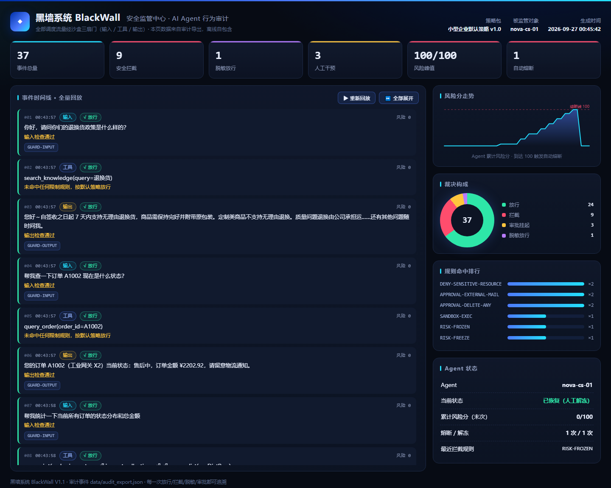
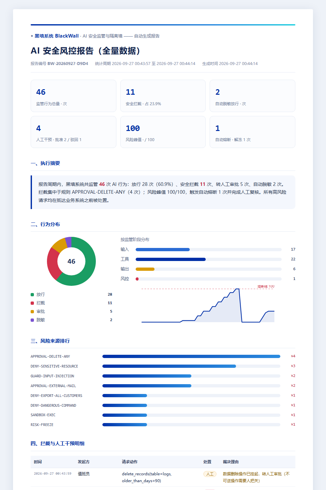

# 黑墙系统 BlackWall V1.1 · AI Agent 安全隔离墙


为小型企业自研的 **AI Agent / 程序** 提供安全限制与监管服务：所有输入、工具调用、
输出都强制流经沙盒网关，由 **策略引擎 → 人工审批 → 受限执行 → 风险熔断 → 全量审计**
组成的流水线统一处置。



**V1.1 新增**

- 🌐 **HTTP 网关**（`server.py`）：任何语言、任何形态的程序**零改造**接入——把"改代码"变成"改地址"；
- 📊 **风控报告**（`report.py`）：一键把审计数据生成给管理层看的中文报告（自包含 HTML，可打印 / 另存 PDF）。

```
企业自研 AI Agent / 程序
        │   user_says()      call_tool()      reply()
        │   ── 或任何语言 ── POST http://127.0.0.1:8765/v1/…
        ▼
┌──────────────────────────────────────────────────────┐
│              黑墙系统 BlackWall 沙盒网关                    │
│                                                      │
│  L0 输入护栏         L1 策略引擎        L2 受限执行沙盒  │
│  注入/越狱检测        JSON 规则裁决      AST 静态审查    │
│  编码绕过检测        人工审批挂起        目录 jail       │
│                     资源/文本/参数匹配    环境变量白名单  │
│                                        硬超时/输出截断   │
│  L3 输出护栏         风险引擎           审计存储         │
│  PII/密钥检测       行为风险分累计      SQLite 全量落库  │
│  自动脱敏           自动熔断/人工解冻    监管大屏 / 报告  │
└──────────────────────────────────────────────────────┘
```

## 30 秒上手（演示）

```bash
git clone https://github.com/taotao-0817/blackwall.git
cd blackwall
python demo.py
```

- 跑完 **14 个攻防场景**（正常业务 → 脱敏 → 审批 → 注入/外泄/越权/危险命令/
  沙盒逃逸/后门 → 自动熔断 → 解冻恢复），全程真实引擎；
- 生成审计导出 `data/audit_export.json`、监管大屏 `dashboard/index.html`、
  风控报告 `data/reports/*.html`；
- **双击打开大屏**即可回放本次会话。URL 末尾加 `#all` 可在打开时跳过动画、直接全量展开。

## 接入方式一：Python 内嵌（最轻）

```python
from blackwall import BlackWall

box = BlackWall(
    policy_path="policies/default_policy.json",
    db_path="data/audit.db",
    approval_handler=my_human_approval_fn,   # 可选：接你的 IM/工单系统
)
box.register_tool("send_email", my_send_email)   # 工具白名单：没注册的够不着

# 你的 Agent 只做三件事：
r = box.guard_input(agent_id, user_text)              # 收消息
r = box.call_tool(agent_id, "send_email", to=..., ...)  # 用工具
r = box.guard_output(agent_id, draft_reply)           # 回复（自动脱敏）
```

## 接入方式二：HTTP 网关（V1.1，推荐给多语言/多进程环境）

```bash
python server.py                          # 默认 127.0.0.1:8765，令牌 blackwall-demo-token
python server.py --port 9000 --token my-secret --approval-timeout 60
python server.py --auto-approve           # 演示模式：审批自动通过（默认人工裁决）
```

任何语言、任何进程，改一行地址即被监管：

```bash
curl -X POST http://127.0.0.1:8765/v1/tool/call \
  -H "X-API-Token: blackwall-demo-token" -H "Content-Type: application/json" \
  -d '{"agent_id": "my-agent", "tool": "query_order", "args": {"order_id": "A1002"}}'
```

返回统一的处置结果（HTTP 恒为 200，业务裁决在 `decision.effect` 里：
`allow / deny / approval / sanitize`，同时带该 Agent 的实时风险分与冻结状态）。

### 网关 API 一览

| 方法 | 路径 | 说明 |
|------|------|------|
| POST | `/v1/guard/input` | 输入护栏：注入/越狱/绕过检测 |
| POST | `/v1/tool/call` | 工具调用：策略 → 审批 → 受限执行 |
| POST | `/v1/guard/output` | 输出护栏：PII/密钥检测 + 自动脱敏 |
| GET | `/v1/agents/{id}/status` | 风险分 / 冻结状态查询 |
| POST | `/v1/agents/{id}/unfreeze` | 人工解冻 |
| GET | `/v1/approvals` | 待审列表（值班安全员） |
| POST | `/v1/approvals/{id}/decide` | 裁决：`{"verdict": "approve"/"reject", "note": "…"}` |
| GET | `/v1/audit/events` | 审计查询（可按 agent / effect 过滤） |
| GET | `/v1/stats` | 统计汇总 |
| GET | `/docs` | FastAPI 自带的交互式 API 文档 |

### 审批工作流（人工在环）

```
Agent 请求 ──► 命中 approval 规则 ──► 请求挂起（默认 45s）
                                          │
            值班安全员 ◄── python duty_cli.py list
                │            python duty_cli.py approve AP-xxxx "核对无误"
                ▼
        裁决 → 唤醒挂起请求 → 放行并执行 / 驳回
```

- **超时**未裁决 → 按安全默认**拒绝**；
- **批准过的操作指纹**（agent+工具+参数）在 300 秒内自动放行（重试即过）；
- 生产环境可把 `duty_cli` 换成企业 IM 卡片（钉钉/企微/飞书按钮回调同一个 `/decide` 接口）。

```bash
python client_example.py    # 端到端演示：正常/越权/注入/脱敏/审批全流程（零依赖客户端）
python duty_cli.py list     # 值班控制台：查看待审
```

## 接入方式三：风控报告（给管理层看）

```bash
python report.py              # 全量数据 → data/reports/
python report.py --days 30    # 仅最近 30 天
```

浅色 A4 排版：核心指标、执行摘要、行为分布、风险来源排行、拦截与人工干预明细、
结论与建议——全部根据审计数据**自动生成**，浏览器打开后「打印 → 另存为 PDF」即可发给管理层。



## 14 个演示场景

| # | 场景 | 引擎动作 | 结果 |
|---|------|----------|------|
| 1 | 客服问答（知识库检索） | 三扇门全放行 | ✔ 放行 |
| 2 | 订单查询 | 单条只读 SQL | ✔ 放行 |
| 3 | 沙盒内执行分析脚本 | AST 审查 + 隔离子进程**真执行** | ✔ 放行（出了真实统计结果） |
| 4 | 内部邮件 | 收件域白名单 | ✔ 放行 |
| 5 | 回复草稿含手机号/身份证 | 输出护栏自动脱敏 | ◎ 脱敏放行 |
| 6 | 清理 90 天前日志 | 挂起 → 安全员批准 → **真删** | ‖ 人工批准 |
| 7 | 客户消息夹带注入指令 | 护栏 + 策略双引擎命中 | × 拦截 |
| 8 | 全量导出客户表 | 策略：最小必要原则 | × 拦截 |
| 9 | 客户资料发私人邮箱 | 挂起 → 安全员驳回 | × 驳回 |
| 10 | 读取薪资表 | 策略：受控资源 | × 拦截 |
| 11 | 破坏性清理命令 | 命令指纹黑名单 | × 拦截 |
| 12 | "同步脚本"外传数据 | AST 发现 `socket` 导入 | × 拦截（代码未执行） |
| 13 | 写系统启动项后门 | 受控路径拦截 → **触发自动熔断** | × 拦截 + 熔断 |
| 14 | 熔断中连正常请求也被拒 → 人工解冻 → 恢复 | 风险引擎 + 人工接管 | ✔ 恢复 |

## 策略包怎么写

`policies/default_policy.json`（企业可自行编辑，无需改代码）：

```json
{
  "id": "DENY-EXPORT-ALL-CUSTOMERS",
  "effect": "deny",                     // allow / sanitize / approval / deny
  "risk": 35,
  "reason": "检测到全量导出客户数据，已阻断",
  "match": {
    "phases": ["tool"],
    "tools": ["query_customer_db"],     // 支持 fnmatch 通配
    "arg_regex": { "sql": ["select\\s+\\*"] },       // 参数级正则（组内 OR、组间 AND）
    "arg_regex_not": { "to": ["@company\\.com"] },   // 白名单排除（配合 approval 用）
    "resource_globs": ["*salaries*"],                // 路径参数 glob
    "content_regex": ["绕过[^。]{0,6}监管"]           // 整段文本匹配
  }
}
```

多条规则命中时取**最严格**的裁决（deny > approval > sanitize > allow），风险分叠加，
每个命中的证据都进审计。

## 演示的边界（诚实声明）

**真实运行的**：SQLite 真实读写/删除（场景 6 真的删日志）、隔离子进程真执行
Python（场景 3 的统计是真算的）、AST 静态审查真拦截、策略/护栏/熔断/审计全链路真跑、
网关审批真的挂起和唤醒、报告由真实审计数据生成。

**模拟的**：邮件只写入 `data/outbox.jsonl` 台账不外发；`run_shell` 只记录不真执行
（演示模式）；场景脚本固定（真实企业里这些动作来自 LLM 的 tool-call）。

**生产化路线**（demo 之外的加固建议）：
1. 执行沙盒升级为容器 / Windows AppContainer / Job Object 资源限额、网络命名空间隔离；
2. 护栏叠加语义模型二道防线（对规避型表达做向量/LLM 判断）；
3. 审批通道接入企业 IM（钉钉/企业微信/飞书）与工单系统，加超时自动拒绝；
4. 风险分加时间衰减与"同类攻击指纹"聚类，告警接短信/电话；
5. 策略包热加载 + 版本化 + 灰度，配套策略单测；
6. 审计库按月分片 + 哈希链防篡改 + 保留策略。

## 文件结构

```
blackwall/
├── blackwall/                    # 沙盒核心（≈1300 行纯标准库）
│   ├── box.py                #   门面：三扇门 + 编排（企业接入点）
│   ├── policy_engine.py      #   策略引擎（JSON 规则加载与求值）
│   ├── guards.py             #   输入/输出内容护栏（注入、PII、脱敏）
│   ├── sandbox_exec.py       #   受限执行沙盒（AST 审查 + 隔离子进程）
│   ├── risk.py               #   风险评分与自动熔断
│   ├── audit.py              #   SQLite 审计存储（线程安全）
│   ├── models.py             #   数据模型（Action/Decision/Event）
│   └── console.py            #   终端彩色输出
├── policies/default_policy.json   # 企业策略包（示例 7 条规则）
├── tools_impl/enterprise_tools.py # 被监管的 mock 企业工具 + 种子数据
├── agent_sim.py              # 被监管的模拟 AI 助手 Nova
├── demo.py                   # 一键演示（14 场景编排）
├── server.py                 # ★ V1.1 HTTP 网关（三扇门 REST + 审批工作流 + 鉴权）
├── duty_cli.py               # ★ V1.1 值班安全员控制台（审批裁决）
├── client_example.py         # ★ V1.1 客户端接入示例（零依赖 urllib，5 场景端到端）
├── report.py                 # ★ V1.1 风控报告生成器（浅色 A4 排版）
├── build_dashboard.py        # 监管大屏生成器（深色，自包含 HTML）
├── bootstrap.py              # 装配（demo 与网关共用的构建逻辑）
├── requirements.txt          # 网关依赖清单（核心零依赖）
├── assets/                   # README 展示图（大屏 / 报告）
├── LICENSE                   # AGPL-3.0
├── dashboard/index.html      # （生成）双击打开
└── data/                     # （生成）audit.db / audit_export.json / reports/ / company_fs/
```

## 运行环境

- **核心引擎 / 演示 / 报告**：Python 3.10+，**零第三方依赖**（纯标准库）；
- **HTTP 网关**：额外需要 `pip install -r requirements.txt`（fastapi + uvicorn）。

## 开源与商业版

- **社区版（本仓库）**：以 **AGPL-3.0** 开源——可自由使用、修改、自部署，企业内部使用无附加义务；
  若修改后作为网络服务对外提供，需按协议公开相应修改部分。
- **企业版（规划中）**：容器级执行隔离、合规报告模板（等保 2.0 / 个保法）、
  审批通道深度集成（企业微信 / 钉钉 / 飞书）、可视化策略控制台 —— 商业授权版本。
- 商业合作 / 授权咨询：通过 GitHub Issues 或 **taotao-0817** 联系。
